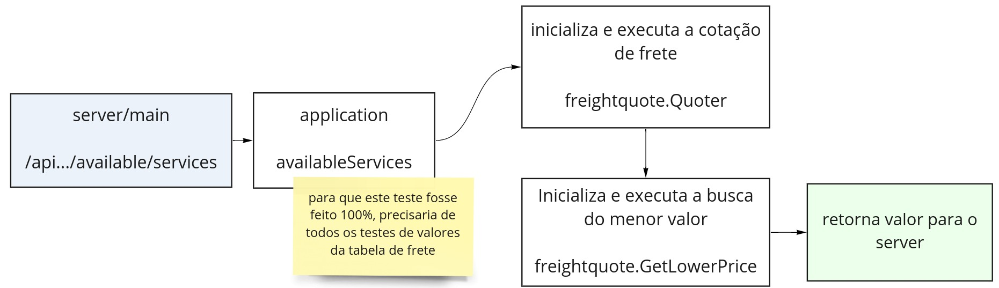
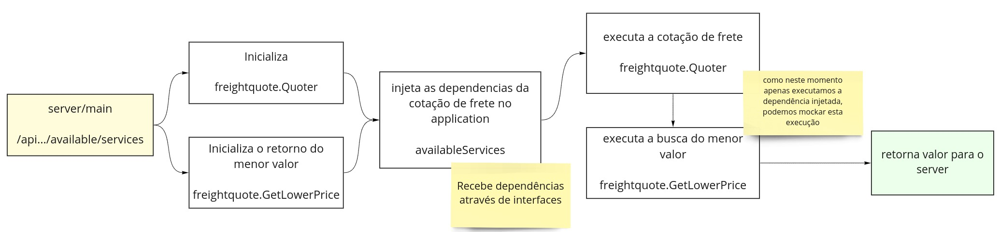

# Injeção de dependência em GOlang
## Design Patterns

André Luiz Leoni
Enjoei.com

---

# Voltando as origens

**S -> Responsábilidade única**
O -> Princípio aberto fechado
L -> Princípio de substituição de liskov
I -> Segregação de Interface
**D -> Inversão de dependência**

---

# S -> Reponsabilidade única

_Quem faz tudo, não faz nada direito_

* Uma classe deve ter uma única responsabilidade, e fazê-la bem feito.

* Caso para alterar mais de um comportamento do sistema, tenha que mexer em mais de um ponto do código, este princípio não foi aplicado.

---

# D -> Inversão de dependência

* Módulos/Classes de alto nível não devem depender de módulos de baixo nível. Ambos devem depender de abstrações;

* Abstrações não devem depender de detalhes. Detalhes devem depender de abstrações.

* *Módulos de alto nível*: são as rotinas mais fáceis de entender, mais próximas da realidade de qualquer programador.

* *Módulos de baixo nível*: são as rotinas mais complexas e difíceis de entender.

* *Detalhes*: são os artefatos que não deveriam fazem parte da arquitetura de forma acoplada, mas que, no entanto, são necessários para um sistema funcionar.

---

# O que é injeção de dependência?

* É um padrão de projeto (Não deve era confundido com o princípio de inversão de dependência do solid);
* O objetivo é dimiunir o acoplamento do código;
* É declarado via abstrações (interfaces) quais são as dependências requeridas para utilização de determinado modulo, classe ou chamada da função da classe.

---

# Quais os benefícios da injeção de dependência?

* Evita alto nível de acoplamento dentro de uma aplicação;
* Facilidade de manutenção;
* Permite criação de testes unitários com mock.

---

# Porque os rubystas não se importam com isso?

* Ruby é interpretado e não compilada;
* Ruby não é uma linguagem tipada;
* Expects e allows sobescrevem o acesso a classe em tempo de execução;
* GOlang é uma linguagem fortemente tipada;
* GOlang é compilado, não é possível sobescrever um metodo em tempo de execução.

---

# E o GOlang?

O Golang possui ferramentas nativas que permitem com que seja utilizado padrões de projeto de _orientação a objeto_ mesmo sendo uma linguagem _C like_.

Aqui tem mais detalhes sobre o que a comunidade pensa sobre isso: https://golang.org/doc/faq#Is_Go_an_object-oriented_language

---

# Sobre Interfaces

```
package main

import "fmt"

type Store interface {
	Sell() bool
}

type EnjuPro struct{}

func (EnjuPro) Sell() bool {
	return true
}

func main() {
	var currentStore Store

	currentStore = EnjuPro{}

	if currentStore.Sell() {
		fmt.Println("Item vendido")
	} else {
		fmt.Println("Não vendido")
	}
}
```

---

# Na prática

---

# Feature de cotação de frete do enjulogistic

Precisávamos verificar a cotação de frete disponível para uma venda, e retornar apenas a cotação de menor valor para ser pre selecionada. (Projeto ainda não foi ativo 100%).

---

# Sobre a arquitetura inicial



---

# Arquitetura com injeção de dependencia



---

# E o ruby? Tem interface?

```
class Base
  attr_readers :width, :height

  def initialize(width:, height:)
    ...
  end

  def area
    raise NotImplementedError.new("precisa ser implementado")
  end
end

class Triangle < Base
end

class Square < Base
  def area
    width * width
  end
end

class Rectangle < Base
  def area
    width * length
  end
end
```

---

# Resumo da ópera

_O Rails é uma mãe!_
